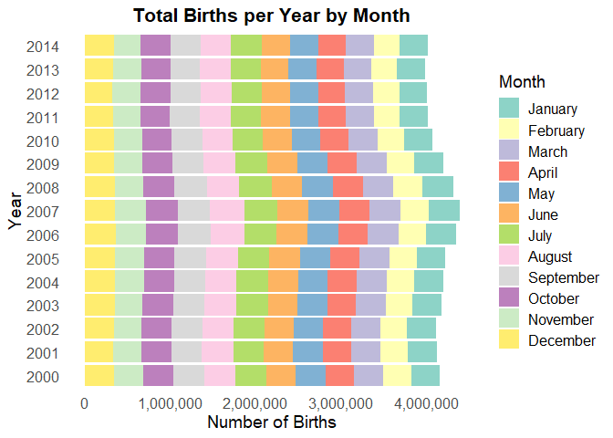
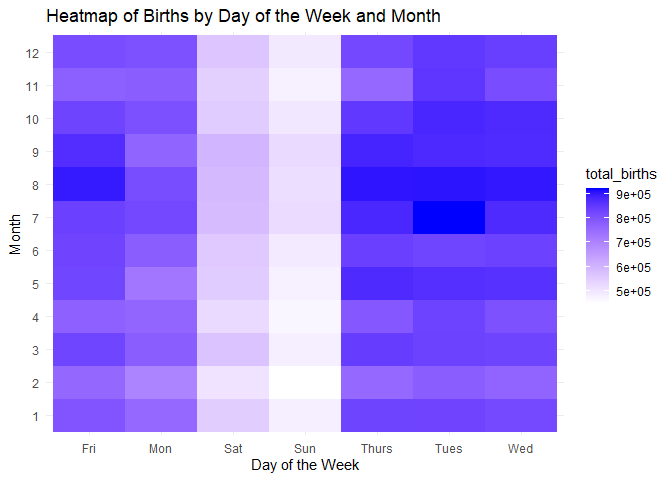
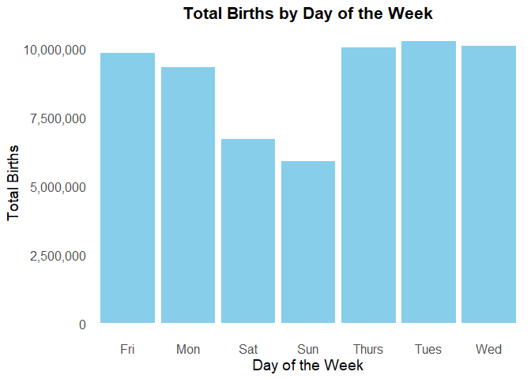
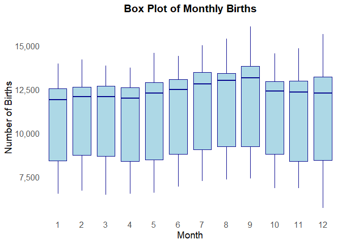
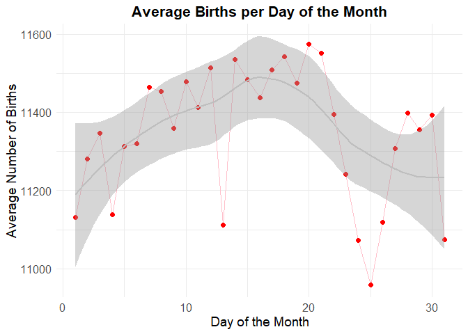

# Data Visualization Project 01


```r
library(ggplot2)
library(dplyr)
```

```
## 
## Attaching package: 'dplyr'
```

```
## The following objects are masked from 'package:stats':
## 
##     filter, lag
```

```
## The following objects are masked from 'package:base':
## 
##     intersect, setdiff, setequal, union
```


```r
df <- read.csv('../data/us_births_00_14.csv')
df %>%
  summary()
```

```
##       year          month        date_of_month       date          
##  Min.   :2000   Min.   : 1.000   Min.   : 1.00   Length:5479       
##  1st Qu.:2003   1st Qu.: 4.000   1st Qu.: 8.00   Class :character  
##  Median :2007   Median : 7.000   Median :16.00   Mode  :character  
##  Mean   :2007   Mean   : 6.523   Mean   :15.73                     
##  3rd Qu.:2011   3rd Qu.:10.000   3rd Qu.:23.00                     
##  Max.   :2014   Max.   :12.000   Max.   :31.00                     
##  day_of_week            births     
##  Length:5479        Min.   : 5728  
##  Class :character   1st Qu.: 8740  
##  Mode  :character   Median :12343  
##                     Mean   :11350  
##                     3rd Qu.:13082  
##                     Max.   :16081
```


```r
births_by_day_of_week <- df %>%
  group_by(day_of_week) %>%
  summarise(total_births = sum(births))
```


```r
births_by_year_month <- df %>%
  group_by(year, month) %>%
  summarise(total_births = sum(births)) %>%
  ungroup()
```

```
## `summarise()` has grouped output by 'year'. You can override using the
## `.groups` argument.
```


```r
month_names <- c("January", "February", "March", "April", "May", "June", 
                 "July", "August", "September", "October", "November", "December")

ggplot(births_by_year_month, aes(x = factor(year), y = total_births, fill = factor(month))) +
  geom_bar(stat = 'identity') +
  scale_fill_manual(values = RColorBrewer::brewer.pal(12, "Set3"), labels = month_names, name = "Month") +
  ggtitle('Total Births per Year by Month') +
  xlab('Year') +
  ylab('Number of Births') +
  scale_y_continuous(labels = scales::comma) +  # Add comma separator for thousands
  coord_flip() +  # Flip coordinates for horizontal bars
  theme_minimal() +
  theme(
    plot.title = element_text(hjust = 0.5, size = 16, face = 'bold'),
    axis.title = element_text(size = 14),
    axis.text = element_text(size = 12),
    legend.title = element_text(size = 14),
    legend.text = element_text(size = 12),
    panel.grid.major = element_blank(),
    panel.grid.minor = element_blank()
  )
```

<!-- -->


```r
# Prepare data for heatmap
heatmap_data <- df %>%
  group_by(month, day_of_week) %>%
  summarise(total_births = sum(births)) %>%
  ungroup()
```

```
## `summarise()` has grouped output by 'month'. You can override using the
## `.groups` argument.
```

```r
ggplot(heatmap_data, aes(x = day_of_week, y = factor(month), fill = total_births)) +
  geom_tile() +
  scale_fill_gradient(low = "white", high = "blue") +
  ggtitle('Heatmap of Births by Day of the Week and Month') +
  xlab('Day of the Week') +
  ylab('Month') +
  theme_minimal()
```

<!-- -->


```r
births_by_day_of_week <- df %>%
  group_by(day_of_week) %>%
  summarise(total_births = sum(births)) %>%
  ungroup()

ggplot(births_by_day_of_week, aes(x = day_of_week, y = total_births)) +
  geom_bar(stat = 'identity', fill = 'skyblue') +
  geom_smooth(method = 'loess', se = FALSE, color = 'black', linetype = 'dashed') +
  ggtitle('Total Births by Day of the Week') +
  xlab('Day of the Week') +
  ylab('Total Births') +
  scale_y_continuous(labels = scales::comma) +
  theme_minimal() +
  theme(
    plot.title = element_text(hjust = 0.5, size = 16, face = 'bold'),
    axis.title = element_text(size = 14),
    axis.text = element_text(size = 12),
    panel.grid.major = element_blank(),
    panel.grid.minor = element_blank()
  )
```

```
## `geom_smooth()` using formula = 'y ~ x'
```

<!-- -->


```r
births_by_day_of_week[order(births_by_day_of_week$total_births), ]
```

```
## # A tibble: 7 × 2
##   day_of_week total_births
##   <chr>              <int>
## 1 Sun              5886889
## 2 Sat              6704495
## 3 Mon              9316001
## 4 Fri              9850199
## 5 Thurs           10045436
## 6 Wed             10109130
## 7 Tues            10274874
```


```r
ggplot(df, aes(x = factor(month), y = births)) +
  geom_boxplot(fill = 'lightblue', color = 'darkblue') +
  ggtitle('Box Plot of Monthly Births') +
  xlab('Month') +
  ylab('Number of Births') +
  theme_minimal() +
  scale_y_continuous(labels = scales::comma) +
  theme(
    plot.title = element_text(hjust = 0.5, size = 16, face = 'bold'),
    axis.title = element_text(size = 14),
    axis.text = element_text(size = 12),
    panel.grid.major = element_blank(),
    panel.grid.minor = element_blank()
  )
```

<!-- -->


```r
average_births_per_day <- df %>%
  group_by(date_of_month) %>%
  summarise(average_births = mean(births))

ggplot(average_births_per_day, aes(x = date_of_month, y = average_births)) +
  geom_line(color = 'pink') +
  geom_point(color = 'red', size = 2) +
  geom_smooth(color = 'grey') +
  ggtitle('Average Births per Day of the Month') +
  xlab('Day of the Month') +
  ylab('Average Number of Births') +
  theme_minimal() +
  theme(
    plot.title = element_text(hjust = 0.5, size = 16, face = 'bold'),
    axis.title = element_text(size = 14),
    axis.text = element_text(size = 12)
  )
```

```
## `geom_smooth()` using method = 'loess' and formula = 'y ~ x'
```

<!-- -->

```r
average_births_per_day[order(average_births_per_day$average_births), ]
```

```
## # A tibble: 31 × 2
##    date_of_month average_births
##            <int>          <dbl>
##  1            25         10959.
##  2            24         11073.
##  3            31         11075.
##  4            13         11111.
##  5            26         11118.
##  6             1         11131.
##  7             4         11138.
##  8            23         11242.
##  9             2         11280.
## 10            27         11308.
## # ℹ 21 more rows
```

