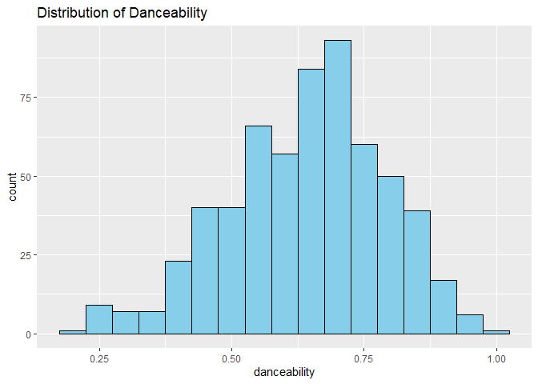
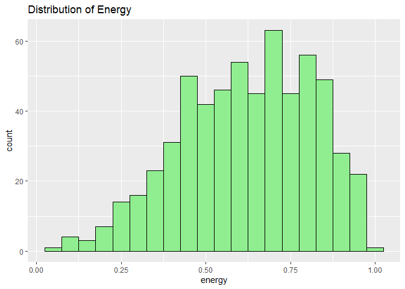
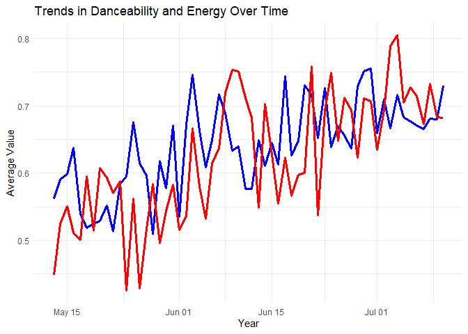
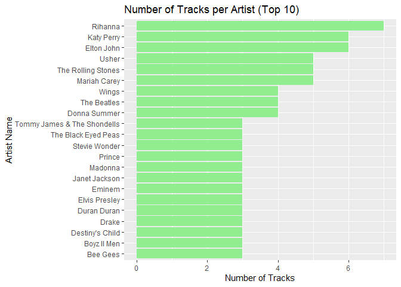
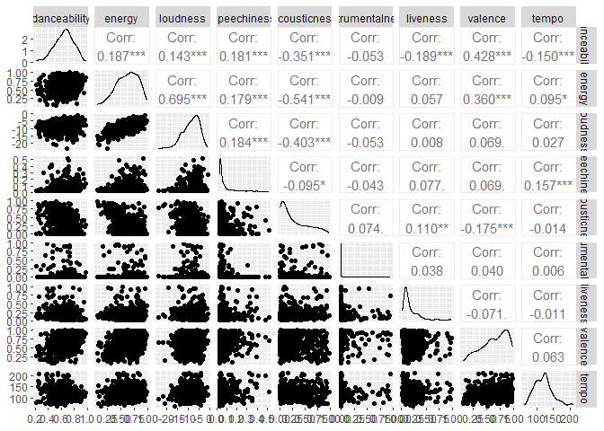
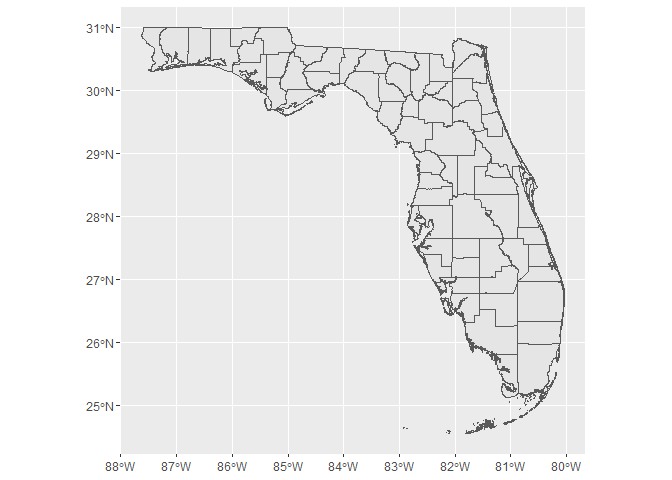

# Data Visualization Project 02


```r
library(dplyr)
```

```
## 
## Attaching package: 'dplyr'
```

```
## The following objects are masked from 'package:stats':
## 
##     filter, lag
```

```
## The following objects are masked from 'package:base':
## 
##     intersect, setdiff, setequal, union
```

```r
library(ggplot2)

# Read the dataset
data <- read.csv("../data/all_billboard_summer_hits.csv")
```


```r
summary(data)
```

```
##   danceability        energy           key               loudness      
##  Min.   :0.2170   Min.   :0.0600   Length:600         Min.   :-23.574  
##  1st Qu.:0.5457   1st Qu.:0.4768   Class :character   1st Qu.:-10.947  
##  Median :0.6480   Median :0.6405   Mode  :character   Median : -8.072  
##  Mean   :0.6407   Mean   :0.6221                      Mean   : -8.587  
##  3rd Qu.:0.7402   3rd Qu.:0.7830                      3rd Qu.: -5.862  
##  Max.   :0.9800   Max.   :0.9890                      Max.   : -1.097  
##      mode            speechiness       acousticness       instrumentalness   
##  Length:600         Min.   :0.02330   Min.   :0.0000488   Min.   :0.0000000  
##  Class :character   1st Qu.:0.03280   1st Qu.:0.0417250   1st Qu.:0.0000000  
##  Mode  :character   Median :0.04140   Median :0.1620000   Median :0.0000032  
##                     Mean   :0.06866   Mean   :0.2665156   Mean   :0.0364316  
##                     3rd Qu.:0.06990   3rd Qu.:0.4472500   3rd Qu.:0.0007132  
##                     Max.   :0.51700   Max.   :0.9870000   Max.   :0.9540000  
##     liveness          valence           tempo         track_uri        
##  Min.   :0.02480   Min.   :0.0695   Min.   : 62.83   Length:600        
##  1st Qu.:0.08595   1st Qu.:0.4790   1st Qu.:100.22   Class :character  
##  Median :0.12400   Median :0.6900   Median :120.01   Mode  :character  
##  Mean   :0.17979   Mean   :0.6488   Mean   :120.48                     
##  3rd Qu.:0.22275   3rd Qu.:0.8482   3rd Qu.:133.84                     
##  Max.   :0.98900   Max.   :0.9860   Max.   :210.75                     
##   duration_ms     time_signature    key_mode         playlist_name     
##  Min.   :103386   Min.   :3.000   Length:600         Length:600        
##  1st Qu.:192887   1st Qu.:4.000   Class :character   Class :character  
##  Median :226927   Median :4.000   Mode  :character   Mode  :character  
##  Mean   :229434   Mean   :3.972                                        
##  3rd Qu.:257854   3rd Qu.:4.000                                        
##  Max.   :557293   Max.   :5.000                                        
##  playlist_img        track_name        artist_name         album_name       
##  Length:600         Length:600         Length:600         Length:600        
##  Class :character   Class :character   Class :character   Class :character  
##  Mode  :character   Mode  :character   Mode  :character   Mode  :character  
##                                                                             
##                                                                             
##                                                                             
##   album_img              year     
##  Length:600         Min.   :1958  
##  Class :character   1st Qu.:1973  
##  Mode  :character   Median :1988  
##                     Mean   :1988  
##                     3rd Qu.:2002  
##                     Max.   :2017
```

```r
data$year <- as.Date(data$year)
```

```r
ggplot(data, aes(x = danceability)) +
  geom_histogram(binwidth = 0.05, fill = "skyblue", color = "black") +
  labs(title = "Distribution of Danceability")
```

<!-- -->

```r
ggplot(data, aes(x = energy)) +
  geom_histogram(binwidth = 0.05, fill = "lightgreen", color = "black") +
  labs(title = "Distribution of Energy")
```

<!-- -->


```r
correlation_matrix <- cor(data[, c("danceability", "energy", "loudness", "tempo")])
print(correlation_matrix)
```

```
##              danceability     energy   loudness       tempo
## danceability    1.0000000 0.18728280 0.14318204 -0.15045686
## energy          0.1872828 1.00000000 0.69455489  0.09492129
## loudness        0.1431820 0.69455489 1.00000000  0.02699862
## tempo          -0.1504569 0.09492129 0.02699862  1.00000000
```

```r
trends_over_time <- data %>%
  group_by(year) %>%
  summarise(avg_danceability = mean(danceability),
            avg_energy = mean(energy))

ggplot(trends_over_time, aes(x = year, y = avg_danceability)) +
  geom_line(color = "blue", size = 1.2) +
  geom_line(aes(y = avg_energy), color = "red", size = 1.2) +
  labs(title = "Trends in Danceability and Energy Over Time", x = "Year", y = "Average Value") +
  theme_minimal()
```

```
## Warning: Using `size` aesthetic for lines was deprecated in ggplot2 3.4.0.
## ℹ Please use `linewidth` instead.
## This warning is displayed once every 8 hours.
## Call `lifecycle::last_lifecycle_warnings()` to see where this warning was
## generated.
```

<!-- -->


```r
artist_track_distribution <- data %>%
  group_by(artist_name) %>%
  summarise(total_tracks = n()) %>%
  arrange(desc(total_tracks)) %>%
  top_n(10)
```

```
## Selecting by total_tracks
```

```r
ggplot(artist_track_distribution, aes(x = reorder(artist_name, total_tracks), y = total_tracks)) +
  geom_bar(stat = "identity", fill = "lightgreen") +
  coord_flip() +
  labs(title = "Number of Tracks per Artist (Top 10)", x = "Artist Name", y = "Number of Tracks")
```

<!-- -->


```r
library(plotly)
```

```
## Warning: package 'plotly' was built under R version 4.3.3
```

```
## 
## Attaching package: 'plotly'
```

```
## The following object is masked from 'package:ggplot2':
## 
##     last_plot
```

```
## The following object is masked from 'package:stats':
## 
##     filter
```

```
## The following object is masked from 'package:graphics':
## 
##     layout
```

```r
library(dplyr)

data$year <- as.Date(data$year)

trends_over_time <- data %>%
  group_by(year) %>%
  summarise(avg_instrumentalness = mean(instrumentalness),
            avg_speechiness = mean(speechiness))

interactive_plot <- plot_ly(trends_over_time, x = ~year, y = ~avg_instrumentalness, name = 'Instrumentalness', type = 'scatter', mode = 'lines') %>%
  add_trace(y = ~avg_speechiness, name = 'Speechiness') %>%
  layout(title = 'Trends in Instrumentalness and Speechiness Over Time',
         xaxis = list(title = 'Year'),
         yaxis = list(title = 'Average Value'),
         legend = list(title = 'Feature'))

htmlwidgets::saveWidget(as_widget(interactive_plot), "interactive_plot_instrumentalness_speechiness.html")
```


```r
library(GGally)
```

```
## Warning: package 'GGally' was built under R version 4.3.3
```

```
## Registered S3 method overwritten by 'GGally':
##   method from   
##   +.gg   ggplot2
```

```r
numeric_data <- select(data, danceability, energy, loudness, speechiness, acousticness, instrumentalness, liveness, valence, tempo)

pair_plot <- ggpairs(numeric_data)

print(pair_plot)
```

<!-- -->

```r
library(ggplot2)
library(sf)
```

```
## Warning: package 'sf' was built under R version 4.3.3
```

```
## Linking to GEOS 3.11.2, GDAL 3.8.2, PROJ 9.3.1; sf_use_s2() is TRUE
```

```r
shapefile <- st_read("../data/Florida_Counties.shp")
```

```
## Reading layer `Florida_Counties' from data source 
##   `C:\Users\jpbg2\OneDrive\Documents\GitHub\dataviz_final_project\data\Florida_Counties.shp' 
##   using driver `ESRI Shapefile'
## Simple feature collection with 67 features and 7 fields
## Geometry type: MULTIPOLYGON
## Dimension:     XY
## Bounding box:  xmin: -87.62601 ymin: 24.54522 xmax: -80.03095 ymax: 30.99702
## Geodetic CRS:  WGS 84
```

```r
ggplot() +
  geom_sf(data = shapefile)
```

<!-- -->
## Introduction

This is my submission for Data Visualization and Reproducible Research Mini Project 2.

## Data Overview

The data set I used was [all_billboard_summer_hits.csv](https://raw.githubusercontent.com/reisanar/datasets/master/all_billboard_summer_hits.csv)

## Data Cleaning and Preparation

The data did not require much processing however I did format the date to a date for easier analysis.


## Initial Plans
I planned to make a chart that showed 2 trend lines in order to see how they diverge or converge. With music, there are trends and seasonal interests so i expected that to show in the data.

## The story
Rihanna is incredibly dominant however this may not be surprising. I was, however, surprised to see names I had never heard of before such as "Wings" and "Donna Summer". They were incredibly high up considering they were foreign names to me.

## Principles
I Did my best to keep my graphs clean and readable. I focused on them being lightweight, not visually noisy, and efficiently communicating information.
