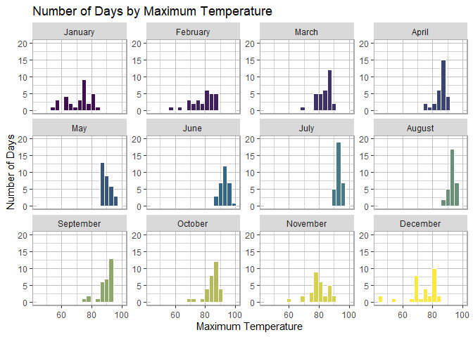
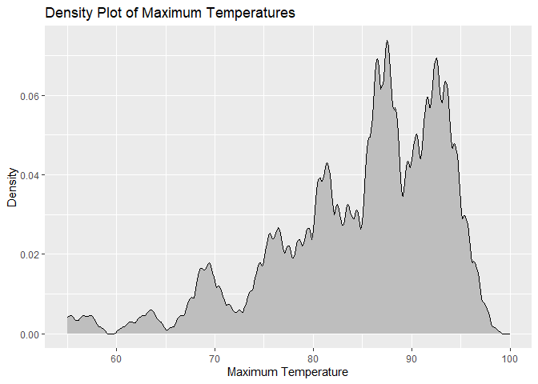
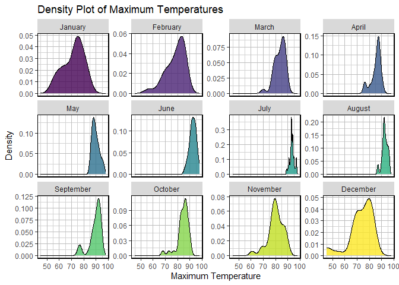
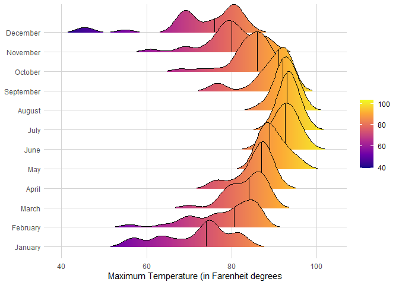
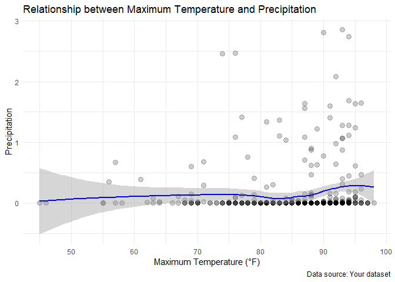
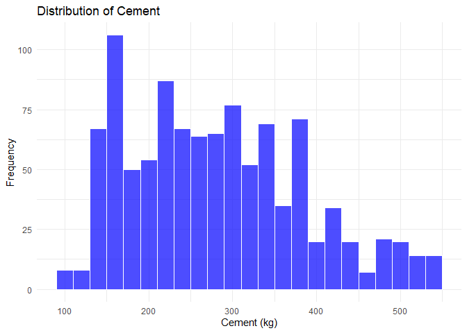
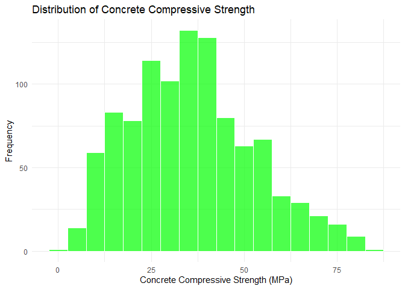
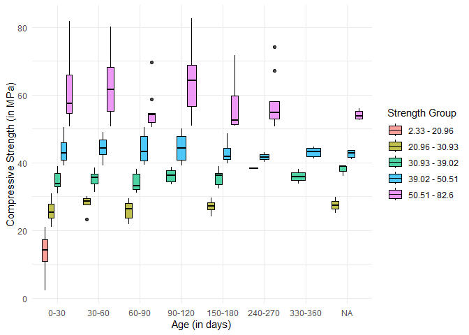
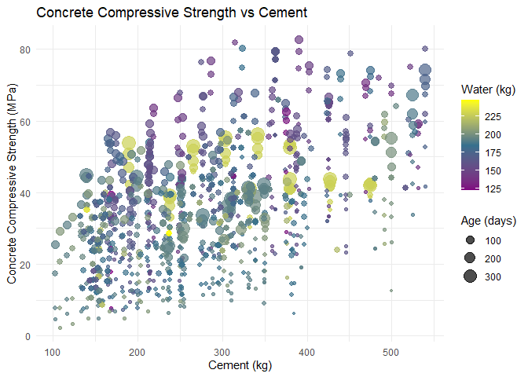

# Data Visualization Project 03


In this exercise you will explore methods to create different types of data visualizations (such as plotting text data, or exploring the distributions of continuous variables).


## PART 1: Density Plots

Using the dataset obtained from FSU's [Florida Climate Center](https://climatecenter.fsu.edu/climate-data-access-tools/downloadable-data), for a station at Tampa International Airport (TPA) for 2022, attempt to recreate the charts shown below which were generated using data from 2016. You can read the 2022 dataset using the code below: 


```r
library(tidyverse)
weather_tpa <- read_csv("../data/tpa_weather_2022.csv")
# random sample 
sample_n(weather_tpa, 4)
```

```
## # A tibble: 4 × 7
##    year month   day precipitation max_temp min_temp ave_temp
##   <dbl> <dbl> <dbl>         <dbl>    <dbl>    <dbl>    <dbl>
## 1  2022     5     2          0          87       71     79  
## 2  2022     8    12          0          92       80     86  
## 3  2022     7     5          0.01       94       81     87.5
## 4  2022     6     9          0.1        88       79     83.5
```

See https://www.reisanar.com/slides/relationships-models#10 for a reminder on how to use this type of dataset with the `lubridate` package for dates and times (example included in the slides uses data from 2016).

Using the 2022 data: 

(a) Create a plot like the one below:


Hint: the option `binwidth = 3` was used with the `geom_histogram()` function.


```r
library(tidyverse)
library(lubridate)

weather_data <- weather_tpa %>%
  mutate(date = make_date(year, month, day),
         month = month(date, label = TRUE, abbr = FALSE))

month_colors <- colorRampPalette(c("#420E52", "#35708D", "#FCE744"))(12)

# Plotting the histogram with facets by month
ggplot(weather_data, aes(x = max_temp)) +
  geom_histogram(binwidth = 3, aes(fill = as.factor(month)), color = "white") + # Remove black outline
  facet_wrap(~ month, scales = "free_y") +
  scale_fill_manual(values = month_colors) +
  labs(title = "Number of Days by Maximum Temperature",
       x = "Maximum Temperature",
       y = "Number of Days") +
  scale_y_continuous(limits = c(0, 20)) +
  #scale_x_continuous(limits = c(0, 100)) +
  #theme_minimal() +
  theme(
    legend.position = "none",
    panel.border = element_rect(color = "darkgrey", fill = NA, size = 1), # Add border around each facet
    panel.background = element_rect(fill = "white", color = NA), # White background
    panel.grid.major = element_line(color = "grey"), # Grey grid lines
    panel.grid.minor = element_line(color = "lightgrey") # Lighter grey minor grid lines
  )
```

```
## Warning: The `size` argument of `element_rect()` is deprecated as of ggplot2 3.4.0.
## ℹ Please use the `linewidth` argument instead.
## This warning is displayed once every 8 hours.
## Call `lifecycle::last_lifecycle_warnings()` to see where this warning was
## generated.
```

<!-- -->


(b) Create a plot like the one below:


```r
ggplot(weather_data, aes(x = max_temp)) +
  geom_density(fill = "grey", color = "black", kernel = "epanechnikov", bw = 0.5) +
  labs(title = "Density Plot of Maximum Temperatures",
       x = "Maximum Temperature",
       y = "Density") +
  xlim(55, 100)
```

```
## Warning: Removed 2 rows containing non-finite values (`stat_density()`).
```

<!-- -->


Hint: check the `kernel` parameter of the `geom_density()` function, and use `bw = 0.5`.

(c) Create a plot like the one below:


Hint: default options for `geom_density()` were used. 


```r
ggplot(weather_data, aes(x = max_temp)) +
  geom_density(aes(fill = as.factor(month)), color = "black", alpha = 0.8) +
  facet_wrap(~ month, scales = "free_y") +
  labs(title = "Density Plot of Maximum Temperatures",
       x = "Maximum Temperature",
       y = "Density") +
  theme(
    legend.position = "none",
    panel.border = element_rect(color = "black", fill = NA, size = 1), # Add border around each facet
    panel.background = element_rect(fill = "white", color = NA), # White background
    panel.grid.major = element_line(color = "grey"), # Grey grid lines
    panel.grid.minor = element_line(color = "lightgrey") # Lighter grey minor grid lines
  )
```

<!-- -->


(d) Generate a plot like the chart below:


Hint: use the`{ggridges}` package, and the `geom_density_ridges()` function paying close attention to the `quantile_lines` and `quantiles` parameters. The plot above uses the `plasma` option (color scale) for the _viridis_ palette.


```r
library(ggridges)
```

```
## Warning: package 'ggridges' was built under R version 4.3.3
```

```r
ggplot(weather_data, aes(x = max_temp, y = month, fill = stat(x))) +
  geom_density_ridges_gradient(scale = 3, rel_min_height = 0.01, quantile_lines = TRUE, quantiles = 2) +
  scale_fill_viridis_c(name = NULL, option = "C") +
  labs(x = "Maximum Temperature (in Farenheit degrees", y = NULL) +
  theme_minimal() +
  theme(
    panel.grid.major = element_line(color = "lightgrey"),  # Set major gridlines to light grey
    panel.grid.minor = element_blank()
  )
```

```
## Warning: `stat(x)` was deprecated in ggplot2 3.4.0.
## ℹ Please use `after_stat(x)` instead.
## This warning is displayed once every 8 hours.
## Call `lifecycle::last_lifecycle_warnings()` to see where this warning was
## generated.
```

```
## Picking joint bandwidth of 1.93
```

<!-- -->


(e) Create a plot of your choice that uses the attribute for precipitation _(values of -99.9 for temperature or -99.99 for precipitation represent missing data)_.


```r
# Filter out missing precipitation data (-99.99)
weather_data_filtered <- weather_data %>%
  filter(precipitation != -99.99)

# Create scatter plot with smoothed line and standard error
ggplot(weather_data_filtered, aes(x = max_temp, y = precipitation)) +
  geom_point(size = 3, alpha = 0.2) +  # Larger points with transparency
  geom_smooth(method = "loess", se = TRUE, color = "blue") +  # Add smoothed line with standard error
  labs(title = "Relationship between Maximum Temperature and Precipitation",
       x = "Maximum Temperature (°F)",
       y = "Precipitation",
       caption = "Data source: Your dataset") +
  theme_minimal()  # Apply a minimal theme
```

```
## `geom_smooth()` using formula = 'y ~ x'
```

<!-- -->

Based on this visualization, I wanted to avoid people missing out on the overwhelming amount of data points that are clustered near the bottom right of the chart. I avoided this by lowering the alpha to 0.2 to emphasize the overlapping occuring there and draw attention away from outliers.

## PART 2 

###Data on Concrete Strength 

Concrete is the most important material in **civil engineering**. The concrete compressive strength is a highly nonlinear function of _age_ and _ingredients_. The dataset used here is from the [UCI Machine Learning Repository](https://archive.ics.uci.edu/ml/index.php), and it contains 1030 observations with 9 different attributes 9 (8 quantitative input variables, and 1 quantitative output variable). A data dictionary is included below: 


Variable                      |    Notes                
------------------------------|-------------------------------------------
Cement                        | kg in a $m^3$ mixture             
Blast Furnace Slag            | kg in a $m^3$ mixture  
Fly Ash                       | kg in a $m^3$ mixture             
Water                         | kg in a $m^3$ mixture              
Superplasticizer              | kg in a $m^3$ mixture
Coarse Aggregate              | kg in a $m^3$ mixture
Fine Aggregate                | kg in a $m^3$ mixture      
Age                           | in days                                             
Concrete compressive strength | MPa, megapascals


Below we read the `.csv` file using `readr::read_csv()` (the `readr` package is part of the `tidyverse`)


```r
concrete <- read_csv("../data/concrete.csv", col_types = cols())
```


Let us create a new attribute for visualization purposes, `strength_range`: 


```r
new_concrete <- concrete %>%
  mutate(strength_range = cut(Concrete_compressive_strength, 
                              breaks = quantile(Concrete_compressive_strength, 
                                                probs = seq(0, 1, 0.2))) )
```


1. Explore the distribution of 2 of the continuous variables available in the dataset. Do ranges make sense? Comment on your findings.


```r
ggplot(new_concrete, aes(x = Cement)) +
  geom_histogram(binwidth = 20, fill = "blue", color = "white", alpha = 0.7) +
  labs(title = "Distribution of Cement",
       x = "Cement (kg)",
       y = "Frequency") +
  theme_minimal()
```

<!-- -->


```r
# Histogram and boxplot for Concrete Compressive Strength
ggplot(new_concrete, aes(x = Concrete_compressive_strength)) +
  geom_histogram(binwidth = 5, fill = "green", color = "white", alpha = 0.7) +
  labs(title = "Distribution of Concrete Compressive Strength",
       x = "Concrete Compressive Strength (MPa)",
       y = "Frequency") +
  theme_minimal()
```

<!-- -->

Based on these distributions, they both have the shape of a log normal distribution. This does not seem strange to me.

2. Use a _temporal_ indicator such as the one available in the variable `Age` (measured in days). Generate a plot similar to the one shown below. Comment on your results.


```r
# Create bins for compressive strength with labels
strength_bins <- quantile(concrete$Concrete_compressive_strength, probs = seq(0, 1, length.out = 6))
strength_labels <- paste0(round(head(strength_bins, -1), 2), " - ", round(tail(strength_bins, -1), 2))

concrete_data <- concrete %>%
  mutate(Strength_group = cut(Concrete_compressive_strength, 
                              breaks = strength_bins,
                              include.lowest = TRUE, labels = strength_labels))

# Create Age groups for better visualization
concrete_data <- concrete_data %>%
  mutate(Age_group = cut(Age, breaks = seq(0, 365, by = 30), include.lowest = TRUE, labels = paste0(seq(0, 335, by = 30), "-", seq(30, 365, by = 30))))

ggplot(concrete_data, aes(x = Age_group, y = Concrete_compressive_strength)) +
  geom_boxplot(aes(fill = Strength_group), color = "black", alpha = 0.7) +
  labs(x = "Age (in days)",
       y = "Compressive Strength (in MPa)",
       fill = "Strength Group") +
  theme_minimal()
```

<!-- -->


3. Create a scatterplot similar to the one shown below. Pay special attention to which variables are being mapped to specific aesthetics of the plot. Comment on your results. 


```r
ggplot(concrete_data, aes(x = Cement, y = Concrete_compressive_strength)) +
  geom_point(aes(size = Age, color = Water), alpha = 0.7) +
  scale_color_gradientn(colors = c("#800080", "#35708D", "#FFFF00"),
                        values = c(0, 0.5, 1),
                        name = "Water (kg)") +
  labs(title = "Concrete Compressive Strength vs Cement",
       x = "Cement (kg)",
       y = "Concrete Compressive Strength (MPa)",
       size = "Age (days)") +
  theme_minimal()
```

<!-- -->


